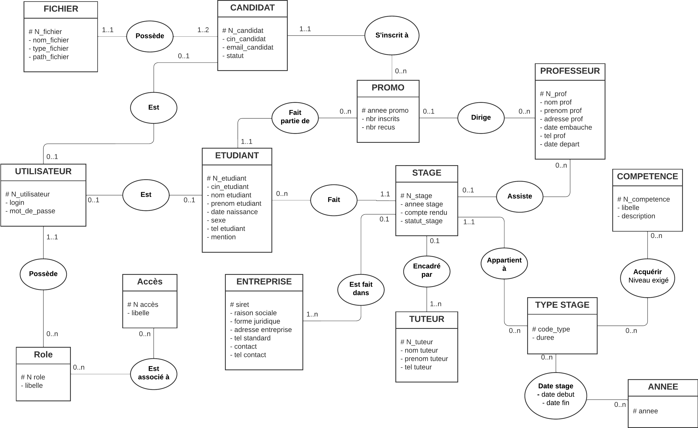
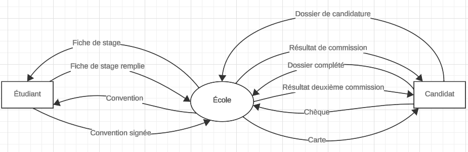
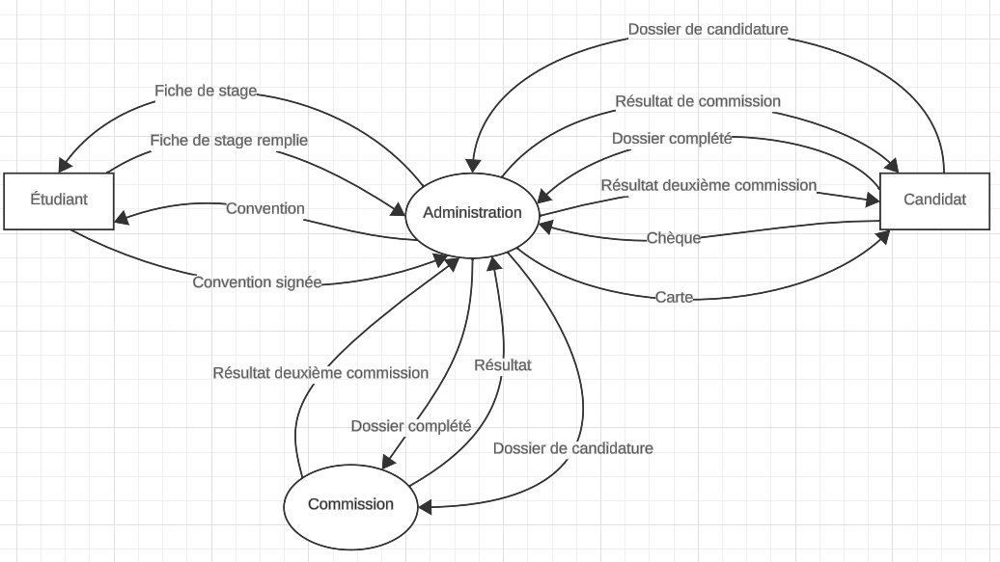

# Application backend pour gestion des stages d'une école (ECM)

## Frontend
Pour voir la partie frontend: 
https://github.com/Cristal32/SI_Angular_front_gestionECM

## Dossier d'analyse

Afin d’assurer une structuration optimale de nos données au sein de notre base, il est nécessaire de suivre une méthodologie de conception rigoureuse. Notre choix s’est porté sur la méthode MERISE (Méthode d’Etude et de Réalisation Informatique pour les Systèmes d’Entreprise), motivé par la clarté et la simplicité de ses modèles, ainsi que par sa capacité à séparer de manière distincte les données des traitements.

### Partie donnnées

#### Dictionnaire de donnnées

  

#### Règles de gestion

• Un candidat accepté devient un étudiant
• Chaque étudiant appartient à une et une seule promotion
• Chaque promotion est dirigée par un professeur
• Un professeur peut diriger une ou plusieurs promotions
• Chaque étudiant est contraint de faire plusieurs stages
• Un stage est effectué par un seul étudiant
• Chaque stage est assisté par un tuteur
• Un tuteur peut assister à plusieurs stages
• Chaque stage est associé à un seul type de stage
• Les compétences à acquérir sont définies avec des niveaux spécifiques
• Les dates de début et de fin de chaque type de stage varient selon l’année.
• Un utilisateur peut être soit un étudiant soit un administrateur

#### MCD: Modèle Conceptuel de Données

  

### Partie traitements

Notre système fait beaucoup de traitements sur les étudiants et leurs stages. Nous avons donc décidé de les décrire et de les modéliser à travers les différents diagrammes de traitement offerts par la méthode Merise. Les traitements concerneront deux parties principales, la gestion des stages, et la gestion des inscriptions.

#### Acteurs

<b>- les acteurs internes :</b> l’administration de la plateforme et les commissions ;  
<b>- les acteurs externes :</b> le candidat et l’étudiant ;

#### MCC: Le Modèle Conceptuel des Communications

  

On peut aussi modèliser le MCC niveau 1 pour visualiser le flux de communications des acteurs internes :

  

#### Traitement des stages

En ce qui concerne le traitement des stages, une fois qu'un étudiant est parvenu à décrocher une opportunité de stage chez une entreprise, il doit formuler une demande à l'administration pour avoir une fiche de stage à remplir auprès de l'organisme d'accueil. Ensuite, il doit renvoyer la fiche remplie aux services de stage de l'école, qui seront, dans notre cas, les administrateurs du système.

